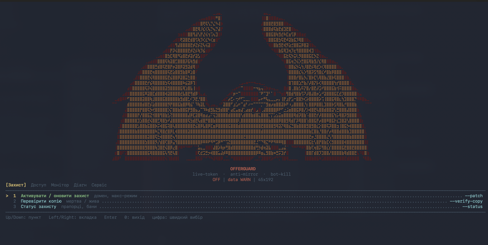

# OfferGuard Patcher

A self-hosted PHP CLI that patches a landing page in place to add bot-detection, IP banning, mirror/copy verification, and live traffic monitoring — no external service, just a single script you run on the box hosting the page.



## Features

- **Protect** — apply or refresh the protection patch on a given HTML/PHP outlet, with a live-token check and a max-protection mode (`--patch`).
- **Verify copy** — check whether a cloned/mirrored copy of the page would still work (`--verify-copy`).
- **Access control** — ban/unban IPs, manage a whitelist, and inspect why a given IP was blocked (`--bans`, `--whitelist`, `--why`).
- **Monitor** — live-tail protection logs and traffic, and review completed sessions (`live`, `--sessions`).
- **Diagnostics** — permissions/`.htaccess` doctor, patch-integrity verification, and site-up recovery for file permissions/secrets (`--doctor`, `--verify`, `--site-up`).
- **Service** — rollback to the pre-patch backup, fully remove all traces, emergency recovery when the site won't load, and reset accumulated state (`--rollback`, `--cleanup`, `--recovery`, `--reset-state`).
- Auto-detects the HTML outlet across common stacks (PHP/Laravel/WordPress `public_html`, Next.js static `out/`, Django/Flask `templates/`).

## Requirements

- PHP CLI (7.4+)
- Shell access to the server hosting the offer/landing page

## Usage

```bash
php patch.php /path/to/html-outlet
```

Point it at the project root and it will look for the outlet itself, or target a specific directory:

```bash
php patch.php /repo/public_html          # PHP/Laravel/WordPress
php patch.php /repo/out                  # Next.js static export
php patch.php /repo/templates            # Django/Flask HTML
php patch.php /repo                      # auto-detect outlet
```

Re-running `--patch` on an already-protected path refreshes the patch in place.

## Menu

The interactive TUI (`php patch.php <path>`) is organized into five tabs:

| Tab | Item | Flag |
| --- | --- | --- |
| **Protect** | Activate / refresh protection — domain, max-mode | `--patch` |
| | Verify copy — dead / alive | `--verify-copy` |
| | Protection status — flags, bans | `--status` |
| **Access** | Bans / online / unban — interactive | `--bans` |
| | Whitelist | `--allow` / `--deny` |
| | Why an IP was blocked | `--why <ip>` |
| **Monitor** | Live monitoring — real-time logs | `live` |
| | Sessions — completed sessions | `--sessions` |
| **Diagnostics** | Doctor — permissions, `.htaccess` | `--doctor` |
| | Verify patch — correctness | `--verify` |
| | Site-up — secret, chmod | `--site-up` |
| **Service** | Rollback — restore `_og_backup` | `--rollback` |
| | Cleanup — remove OfferGuard traces | `--cleanup` |
| | Recovery — site won't load | `--recovery` |
| | Reset state — bans, logs | `--reset-state` |

Useful one-offs: `--unban <ip>`, `--allow <ip>` / `--deny <ip>`, `--canonical-host=your-domain.com`, `--og-htaccess=1`, `--xlog-tail` / `--xlog-clear`, `--scan-deep`.

## Files

```
patch.php   # the CLI itself — patch, monitor, diagnose, roll back
e.sh        # server bootstrap: DNS + Tailscale setup for a fresh host
```

Patching creates a `_og_backup` (for `--rollback`) and an `_og_data` state directory (bans, sessions, logs) next to the outlet — both are local to the host and shouldn't be committed.
